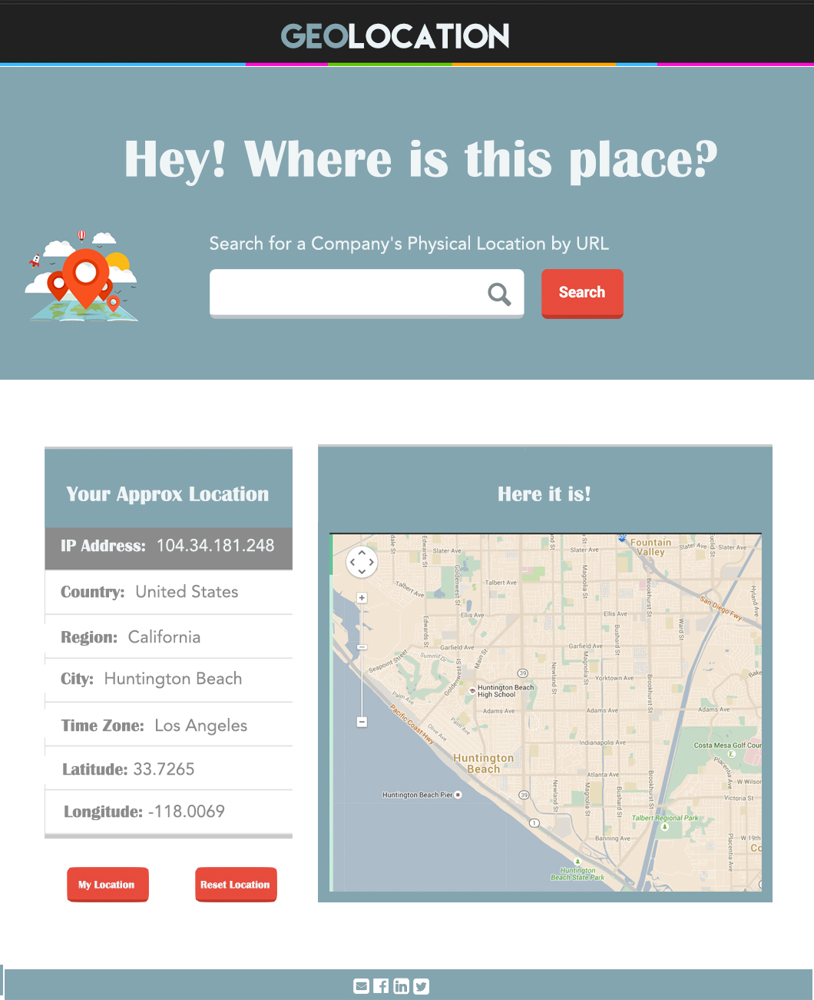

# Avenue Code UI Challenge - Part I #

    * Mention anything that was asked but not delivered and why, and any additional comments.

### How to compile and run the application.
1. In your terminal, go to the directory where you want to download this repo.
2. To clone the repo, enter this in your termina: `https://jessiewuwu@bitbucket.org/jessiewuwu/ui-challenge.git`
3. Open the app in your browser either by entering `open index.html` in your terminal or by locating the directory in your Finder and double-clicking index.html.
4. Because everything is set up with CDN links and everything needed is in the directory, you don't need to install anything.

## How to run the suite of automated tests
* Testing is done in Jasmine, a Behavior-Driven-Development testing framework.
1. In your terminal, go to the js folder and open SpecRunner.html.
2. To see the tests, go to js > spec > ModelSpec.js

## Technologies and Libraries Used
* Backbone - I recently started studying Backbone and enjoy the simplicity of it.
* jQuery + Ajax - These two are my two absolute favorite things to do. I love being able to manipulate elements and data and if I could, I'd do jQuery and Ajax all day!
* Bootstrap for grid columns and responsiveness, along with media queries
* SASS - I used SASS mostly for the variables and nesting. SASS is so important because it makes CSS seem like a programming language by adding logic to it.
* Jasmine - Jasmine is very similar to rspec, a testing tool that we worked with a lot during Dev Bootcamp and I love how the tests are displayed in the browser, unlike rspec in the console.

## To-Do's
* Add more design to the app based on my mockup:


* Currently, when we have the company location and user's location, the map only focuses on the location that was last clicked. I was able to pseudocode a possible way to add boundaries and have both pinpoints in the map. In geolocation.js, on line 38 and 29, I determined the bounds so that map could fit to these bounds and added another feature where it would zoom out to include these bounds.
* The given GeoIP API doesn't give an exact latitude and longitude because it rounds up after the tenth decimal, which makes the location inaccurate by a few blocks.
  * Possible Solution - find a better API that gives exact latitude and longitude. Ideally it would also be nice to get the physical address of the location so that the user can also have that information, rather than just a pinpoint in the map.
  * Possible Solution - instead of using a pinpoint, use a circle range to cover a broad area (about 5x5 block radius). However, this would be a huge circle so the first solution may be more ideal.
* After clicking Reset Location (without looking up a company URL), the Map pinpoints the ocean. Instead, it should zoom out and center on the entire United States. I tried looking into this and believe this would require another function that takes zoom integer into consideration. Right now the initialize function that runs the Google Maps API is hardcoded with zoom integer of 12. Since the United States is quite big, we would have to zoom out.
* Jasmine Testing - I will admit, testing is not my strongest suit. It is definitely something I feel is very valuable to programming because it checks for quality, working code in the long run. I learned Jasmine over a span or one or two days during Dev Bootcamp and something we didn't prioritize for our final project, so I didn't have as much exposure and practice as I liked.

For this app, I wanted to test Ajax with Jasmine so I started looking into Jasmine spies. On Jasmine's github, there was documentation on using mock Ajax to test the data received from API's. Although I wasn't able to successfully implement this with the given time, I feel like I am able to do it looking at more resources on my own or pairing with an engineer.

Testing is something I plan on diving deeper and perfecting. I am adding more projects to my portofolio and will be doing test-driven-development. I am pretty confident with enough practice, I can write tests in my sleep. I believe I have the foundation in testing but just need a bit more practice and room before I can spread my wings, or as R. Kelly would say "If I can see it, then I can do it (I can do it). If I just believe it, there's nothing to it. I believe I can fly"


### Story Phrase ###
* As a curious web surfer, I want to be able to locate both me and any website on a map.
* I sometimes use a desktop, sometimes a tablet and sometimes a cell phone, so I need a responsive web page.

### Business Narrative / Scenario ###
* GeoLocation is a working web application which aims to retrieve details about the user's location.
* You need to augment GeoLocation with a new form that will allow the user to find out the physical location of websites, by displaying its hosting position on a map.
* This new form will consist in a text field for the user to input the website domain, and also a "Locate" button.
* You have to keep the current features working.

### Functional / Acceptance Criteria ###
* The new form input field should only accept website domains starting with "www."  or with the host name, e.g., "www.nytimes.com", "nytimes.com" or "g1.com.br" or "www.g1.com.br".
* When the user hits the Locate button, an asynchronous call should be made to http://freegeoip.net/json/:host, where :host corresponds to the user input.
* If this async call is successful, a second panel must be rendered, below the form, displaying a map showing the website's physical location from the latitude and longitude coordinates of the JSON response.
* When the user hits the existing My location button, his position must also be displayed on the map, **alone or besides a website location** if the user used that feature before.
* When the user hits the Reset location button, the user location must be cleared off from the map (but the website's location should still be displayed if any).
* You need to add consistent user input and output validations for every possible scenario.


### Non-Functional / Acceptance Criteria ###
* We urge that you employ a web app framework such as Backbone.js, AngularJS, Ember.js, Knockout.js, React, Meteor.
* You must leverage reusability with the existing code. You might have to refactor some of it, specially when you are adopting a web framework. Make sure to keep the existing functionality up and also to fix any bugs you might run into.
* It is expected that you cover at least 80%+ of your code with JS testing. You can pick a framework of your preference like Jasmine, Chai, Mocha, QUnit.
* We also recommend that you use a presentation framework such as Twitter Bootstrap or Zurb Foundation.

### Technical Details ###
You should receive a JSON response from http://freegeoip.net/json/:host similar to:

```
{
   "ip":"170.149.172.130",
   "country_code":"US",
   "country_name":"United States",
   "region_code":"WA",
   "region_name":"Washington",
   "city":"Seattle",
   "zipcode":"",
   "latitude":47.6062,
   "longitude":-122.3321,
   "metro_code":"819",
   "area_code":"206"
}
```

Here are a few suggestions of tools to develop your responsive app:

* Backbone.js - http://backbonejs.org/
* AngularJS - http://angularjs.org/
* KnockoutJS - http://knockoutjs.com/
* Ember.js - http://emberjs.com/
* React - http://facebook.github.io/react/
* Meteor - https://www.meteor.com/
* JQuery - http://jquery.com/
* Twitter Bootstrap - https://twitter.github.com/bootstrap/
* Zurb Foundation - http://foundation.zurb.com/
* RequireJS - http://requirejs.org/
* Underscore - http://underscorejs.org/
* Handlebars - http://handlebarsjs.com/
* Jasmine - http://jasmine.github.io/
* Chai - http://chaijs.com/
* Mocha - http://visionmedia.github.io/mocha/
* QUnit - http://qunitjs.com/
* SASS - http://sass-lang.com/
* LESS - http://lesscss.org/

### Delivery Instructions ###

1. You must provide his BitBucket username. A free BitBucket account can be created at http://bitbucket.org
1. The recruiter will give you read permission to a repository named **ui-challenge**, at https://bitbucket.org/ac-recruitment/ui-challenge
1. You must fork this repository into a private repository on your own account and push your code in there.
1. Once finished, you must give the user **ac-recruitment** read permission on your repository so that you can be evaluated. Then, please contact back your recruiter and he will get an engineer to evaluate your test.
1. After you are evaluated, the recruiter will remove your read permission from the original repository.
1. Its very important that these steps are followed accordingly, as your git and overall version control skill will also be evaluated.

### Format ###

* This assessment must be delivered within 2 days.
* You must provide a README.txt (plain text) or a README.md (Markdown) file at the root of your repository, explaining:
    * How to compile and run the application.
    * How to run the suite of automated tests (unit tests, BDD tests, etc...).
    * Which JS libraries you've decided to use for this challenge.
    * Mention anything that was asked but not delivered and why, and any additional comments.
* Unclear or incomplete README instructions may subtract from your overall evaluation.
* Any questions, please send an email to **recruitment.engineering@avenuecode.com**

### Evaluation Criteria ###

1. Functional and non-functional acceptance criteria delivery.
1. Code quality: structure, modularization, reuse.
1. Code legibility and elegancy.
1. Frameworks usage.
1. Test coverage.

We have both functional and non-functional acceptance criterias, so we suggest that you pay attention to both. Furthermore, the quality of the application (number of bugs found), may also add or subtractg points from the candidate.

